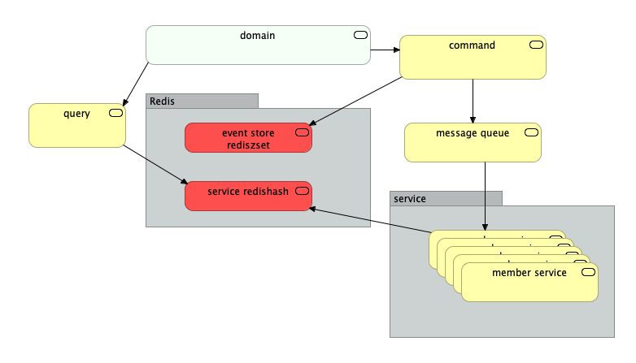
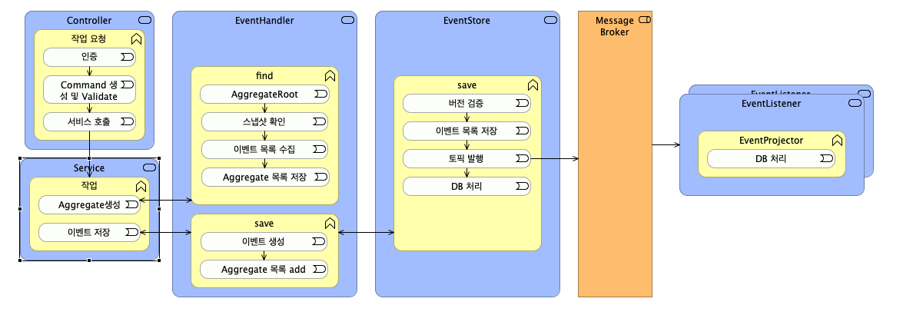
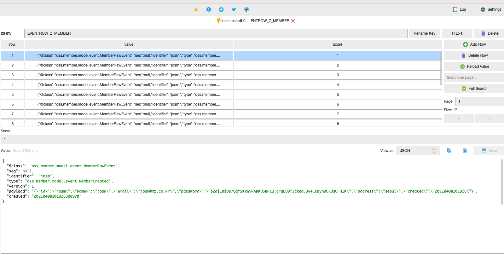
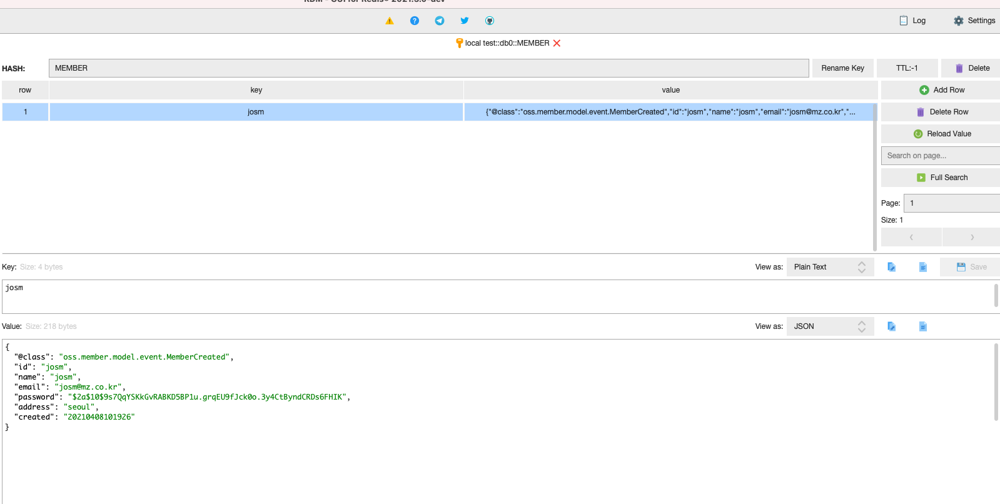

# base springcamp2017

# skywalking 
- member 에 적용
- 구동 옵션
``` command
-javaagent:skywalking/skywalking-agent.jar
```

# cqrs
- member 에 우선 적용
- data flow

- app flow

- redis eventstore

- redis datahash



# google captchar3

1. eventsourcing &amp; cqrs demo project


gradle wrapper --gradle-version 6.0


## Required

* Java8
* Redis 2.x - using default port ( 6379 )
* Mysql 5.x - using default port ( 3306 )
* Zookeeper - using default port( 2181 )
* Kafka - using port ( 9092 )
* Git


## Install 참조 소스  

git clone https://github.com/jaceshim/springcamp2017.git

cd /Users/mz03-jmryu/Project/skt/springcamp2017


## DB 접속 ( DBeaver)
localhost:3306
root/root

create database & table ( default user is root )

/Users/mz03-jmryu/Project/skt/springcamp2017/order/scripts/create_database_table.sql
/Users/mz03-jmryu/Project/skt/springcamp2017/member/scripts/create_database_table.sql
/Users/mz03-jmryu/Project/skt/springcamp2017/member/scripts/create_database_table.sql


## hosts file 수정

sudo vi /etc/hosts
127.0.0.1 member.pilot.com order.pilot.com product.pilot.com


## SpringBoot Application 실행 

cd member; ../gradlew bootRun
cd order; ../gradlew bootRun
cd product; ../gradlew bootRun


## access the URL 
http://member.pilot.com:10001/regist

 - 회원가입 
 - 로그인
 - 상품등록 

## 솔루션설치 

cd docker_chicordb

docker-compose up


-javaagent:./scouter/scouter.agent.jar
-Dscouter.config=./scouter/conf/scouter.conf


# redis local 
spring:
  redis:
    # store-type: redis
    host: localhost
    port: 6379
    timeout: 300s
    prefix: tutorial
    
# redis stg     
spring:
  redis:
    store-type: redis
    host: chicor-dev-redis-cache.zuuqx4.clustercfg.apn2.cache.amazonaws.com
    port: 6379
    timeout: 300s
    prefix: tutorial
    cluster:
      nodes:
        - chicor-dev-redis-cache-0001-001.zuuqx4.0001.apn2.cache.amazonaws.com:6379
        - chicor-dev-redis-cache-0001-002.zuuqx4.0001.apn2.cache.amazonaws.com:6379
        - chicor-dev-redis-cache-0002-001.zuuqx4.0001.apn2.cache.amazonaws.com:6379
        - chicor-dev-redis-cache-0002-002.zuuqx4.0001.apn2.cache.amazonaws.com:6379      
            

           
# redis      
RedisClusterConfigurationProperties.java
RedisConfig.java


# StringDeserializer

import com.fasterxml.jackson.databind.deser.std.StringDeserializer
import org.apache.kafka.common.serialization.StringDeserializer;
import org.apache.kafka.common.serialization.StringSerializer;


Hibernate 4.x -> Hibernate 5.x 변경시 유의 사항.

@GeneratedValue(strategy = GenerationType.AUTO) 
@GeneratedValue(strategy = GenerationType.IDENTITY)


/Users/mz03-jmryu/Project/workspace.skt/cqrs-redis/member

